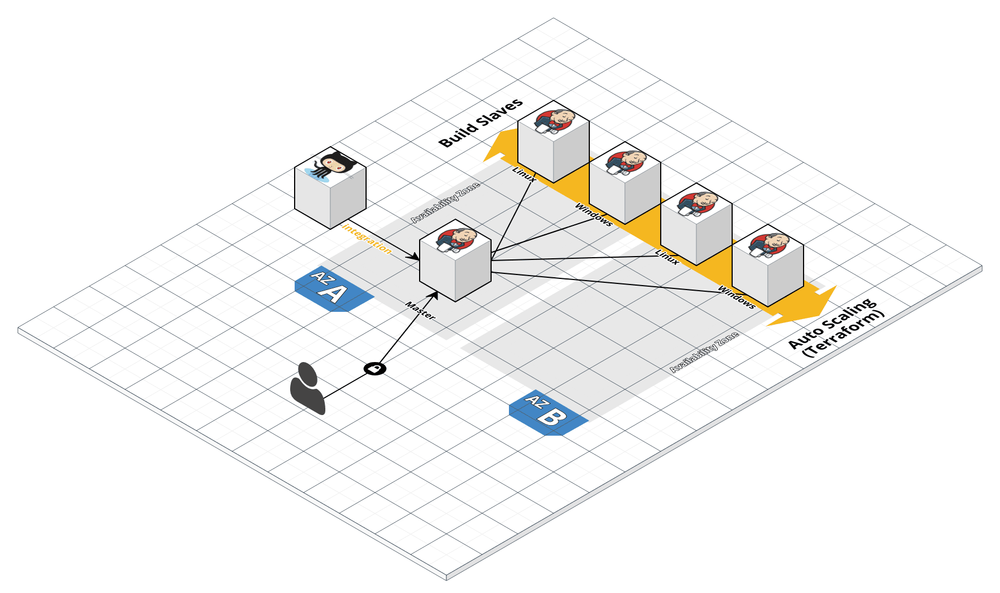

# Jenkins AWS Module

This repo contains a Module for how to deploy a [Jenkins](https://jenkins.io/) cluster on 
[AWS](https://aws.amazon.com/) using [Terraform](https://www.terraform.io/). Jenkins is a distributed automation server, generally associated with [Continuous Integration (CI)](https://en.wikipedia.org/wiki/Continuous_integration) and [Continuous Delivery (CD)](https://en.wikipedia.org/wiki/Continuous_delivery).  A Jenkins cluster typically involves one
or more [master](https://wiki.jenkins.io/display/JENKINS/Distributed+builds) instance(s) coupled with one or more [slave](https://wiki.jenkins.io/display/JENKINS/Distributed+builds) instance(s):




## How to use this Module

Each Module has the following folder structure:

* [root](https://github.com/ignw/terraform-aws-jenkins/tree/master): This folder shows an example of Terraform code 
  that uses the [jenkins-master](https://github.com/ignw/terraform-aws-jenkins/tree/master/modules/jenkins-master) and
  [jenkins-slave](https://github.com/ignw/terraform-aws-jenkins/tree/master/modules/jenkins-slave) module(s) to 
  deploy a [Jenkins](https://www.jenkins.io/) cluster in [AWS](https://aws.amazon.com/).
* [modules](https://github.com/ignw/terraform-aws-jenkins/tree/master/modules): This folder contains the reusable code for this Module, broken down into one or more modules.
* [examples](https://github.com/ignw/terraform-aws-jenkins/tree/master/examples): This folder contains examples of how to use the modules.
* [test](https://github.com/ignw/terraform-aws-jenkins/tree/master/test): Automated tests for the modules and examples.

To deploy Jenkins servers using this Module:

1. Create a Jenkins Master AMI using a Packer template installs jenkins and all of the required dependencies.
   Here is an [example Packer template](https://github.com/ignw/terraform-aws-jenkins/tree/master/examples/jenkins-ami#quick-start). 
   
   If you are just experimenting with this Module, you may find it more convenient to use one of our official public AMIs:   
   - [Latest Master AMIs (Amazon Linux)](https://github.com/ignw/terraform-aws-jenkins/tree/master/_docs/amazon-linux-ami-list.md).
   - [Latest Slave AMIs (Amazon Linux)](https://github.com/ignw/terraform-aws-jenkins/tree/master/_docs/amazon-linux-ami-list.md).
  
    **WARNING! Do NOT use these AMIs in your production setup. In production, you should build your own AMIs in your own 
    AWS account.**
   
2. Deploy those AMIs to your AWS region using the Terraform [jenkins-master module](https://github.com/ignw/terraform-aws-jenkins/tree/master/modules/jenkins-master) 
   and execute the [jenkins-slave module](https://github.com/ignw/terraform-aws-jenkins/tree/master/modules/jenkins-slave)  Here is [an example Terraform 
   configuration](https://github.com/ignw/terraform-aws-jenkins/tree/master/MAIN.md#quick-start) to provision a Jenkins cluster.

To deploy Jenkins clients using this Module:
 
```
terraform init

terraform plan --var "ssh_key_name=ignw_dev" \
--var "ssh_key_path=~/.ssh/ignw_dev.pem" \
--var "linux_slave_count=1" \
--var aws_ssl_certificate_arn="arn:aws:acm:us-east-1:xxxxxxxxxxx" \
--var dns_zone="example.com" \
--var app_dns_name="jenkins.example.com" \

terraform apply --var "ssh_key_name=ignw_dev" \
--var "ssh_key_path=~/.ssh/ignw_dev.pem" \
--var "linux_slave_count=1" \
--var aws_ssl_certificate_arn="arn:aws:acm:us-east-1:xxxxxxxxxxx" \
--var dns_zone="example.com" \
--var app_dns_name="jenkins.example.com" \

```
Argument | Description
--- | ---
name | The name to be used on all instances as a prefix
ssh_key_name | AWS SSH Key Pair name
ssh_key_path | Path to AWS SSH Key Pair private key pair used for provisioning
linux_slave_count | The number of Jenkins Linux Build Slaves to provision
win_slave_count | The number of Jenkins Windows Build Slaves to provision
instance_type_master | The instance type to be used on the master instance. Default: t2.micro
instance_type_slave | The instance type to be used on the slave instance(s). Default: t2.micro
setup_data | The script used to setup the Jenkins master instance and install plugins.  Default: ./modules/jenkins-master/setup.tpl 
http_port | The port to use for HTTP traffic to Jenkins
jnlp_port | The Port to use for Jenkins master to slave communication bewtween instances
plugins | The list of plugins to pre-install on the master instance. Default: ["git", "xunit"]
tags | A map of tags to add to all resources
master_ami_id | ID of the AMI to use for master instance. Default: lookup latest IGNW master AMI
linux_slave_ami_id | ID of the AMI to use for linux slave instance(s). Default: lookup latest IGNW linux slave AMI
win_slave_ami_id | ID of the AMI to use for windows slave instance(s). Default: lookup latest IGNW windows slave AMI
aws_ssl_certificate_arn | Amazon Resource Name for the certificate to be used on the load balancer for HTTPS
dns_zone | DNS zone in AWS Route53 to use for the Application Load Balancer (ALB)
app_dns_name | DNS name within the zone to dynamically point to the ALB

## What's a Module?

A Module is a canonical, reusable, best-practices definition for how to run a single piece of infrastructure, such 
as a database or server cluster. Each Module is created using [Terraform](https://www.terraform.io/), and
includes automated tests, examples, and documentation. It is maintained both by the open source community and 
companies that provide commercial support. 

Instead of figuring out the details of how to run a piece of infrastructure from scratch, you can reuse 
existing code that has been proven in production. And instead of maintaining all that infrastructure code yourself, 
you can leverage the work of the Module community to pick up infrastructure improvements through
a version number bump.
 
 
 
## Who maintains this Module?

This Module is maintained by [IGNW](http://www.ignw.io/). If you're looking for help or commercial 
support, send an email to [support@infogroupnw.com](mailto:support@infogroupnw.com?Subject=Jenkins%20Module). 
IGNW can help with:

* Setup, customization, and support for this Module.
* Modules for other types of infrastructure, such as VPCs, Docker clusters, databases, and continuous integration.
* Modules that meet compliance requirements, such as FedRamp, HIPAA.
* Consulting & Training on AWS, Azure, GCP, Terraform, and DevOps.


## Code included in this Module:

* [jenkins-master](https://github.com/ignw/terraform-aws-jenkins/tree/master/modules/jenkins-master): The module includes Terraform code to deploy a Jenkins master on AWS and setup [plugins](https://plugins.jenkins.io).
  
* [jenkins-slave](https://github.com/ignw/terraform-aws-jenkins/tree/master/modules/jenkins-slave): The module includes Terraform code to deploy a Jenkins [slave](https://wiki.jenkins.io/display/JENKINS/Distributed+builds) on AWS and connect it to it's [master](https://wiki.jenkins.io/display/JENKINS/Distributed+builds). 

* [jenkins-security-group-rules](https://github.com/ignw/terraform-aws-jenkins/tree/master/modules/jenkins-security-group-rules): Defines the security group rules used by a 
  Jenkins cluster to control the traffic that is allowed to go in and out of the cluster.


## How is this Module versioned?

This Module follows the principles of [Semantic Versioning](http://semver.org/). You can find each new release, 
along with the changelog, in the [Releases Page](../../releases). 

During initial development, the major version will be 0 (e.g., `0.x.y`), which indicates the code does not yet have a 
stable API. Once we hit `1.0.0`, we will make every effort to maintain a backwards compatible API and use the MAJOR, 
MINOR, and PATCH versions on each release to indicate any incompatibilities. 


## License

This code is released under the Apache 2.0 License. Please see [LICENSE](https://github.com/ignw/terraform-aws-jenkins/tree/master/LICENSE) and [NOTICE](https://github.com/ignw/terraform-aws-jenkins/tree/master/NOTICE) for more 
details.

Copyright &copy; 2017 InfogroupNW, Inc.
